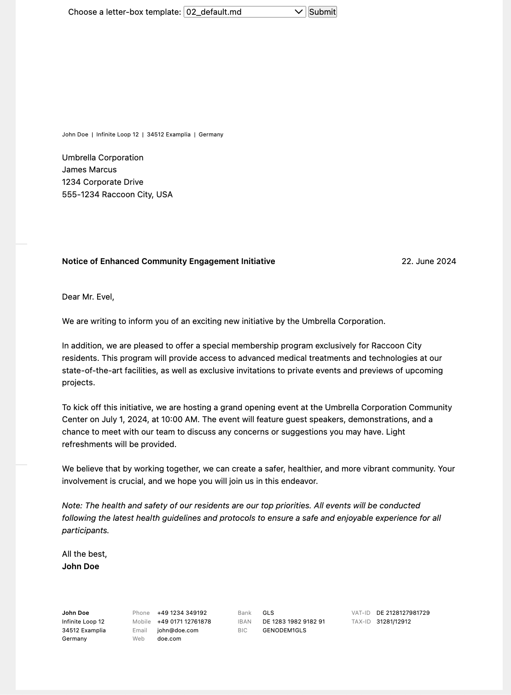

# Letter

Letter is a simple, highly customizable tool designed to help you create professional letters directly in your browser. This tool allows you to write your letters in a markdown file and load its content into a letter template for easy formatting and presentation.

# Background Motivation
Instead of messing around in Word, Pages or even Indesign, you can write your letters in the browser, export them as HTML or PDF (via Apple Preview). 

Written in plain HTML, CSS and some PHP, Letter can be installed in seconds and run either on your machine with PHP's built-in server, something like MAMP or on a server. 

You can setup your own letter template and customize the design with CSS. 

# Features
- Markdown Support: Write your letters using Markdown, making it easy to format text.
- Customizable Templates: Load your markdown content into customizable letter templates.
- Browser-Based: Create and edit your letters directly in your web browser.
- Simple File Management: Store your markdown files in a designated folder for easy access.

# Screenshot 



## Original Demo

This is how Letter looks like in original: https://bastianallgeier.com/projects/letter/

## Getting started

```
git clone https://github.com/bastianallgeier/letter.git
cd letter
php -S localhost:8888
```


## How to…

### Save Letters
You can save your letters by simply using the browser save dialog. Make sure to choose "Save HTML only" as the export option. You will get a nice and clean HTML file of your letter, which can be kept for later at any place you prefer. 

### Print Letters
Use your browser's print dialog to print your finished Letters. Make sure to set "No margins" in your printing dialog to avoid broken dimensions of your document. 

### Export PDFs
On macOS you can use your browser's print dialog to export your Letter to PDF via Apple Preview. As long as you get the printing settings correct, the PDF will look good too. 

### Create a markdown file with your letter content
Create a new markdown file under the ./letter-boxes directory. For example see the existing file *02_default.md*

## Setup

### Configuration 

You can setup the global content of your Letter in `config/config.php`. Adjust the default settings and add your own data there. 

#### Available options

```php
return [
  'title'      => 'Letter',
  'dateFormat' => 'dmY',
  'name'       => 'John Doe',
  'street'     => 'Infinite Loop 12',
  'city'       => '34512 Examplia',
  'country'    => 'Germany',
  'phone'      => '+49 1234 349192',
  'mobile'     => '+49 0171 12761878',
  'email'      => 'john@doe.com',
  'website'    => 'doe.com',
  'bank'       => 'GLS',
  'iban'       => 'DE 1283 1982 9182 91',
  'bic'        => 'GENODEM1GLS',
  'vatId'      => 'DE 2128127981729',
  'taxId'      => '31281/12912',
  'closing'    => 'All the best,',
  'placeholders' => [
    'address' => 'Acme Corp.<br>Sesamestreet 23<br>12345 Gotham City<br>USA',
    'subject' => 'Subject',
    'text'    => '<p>Dear…</p><p>Lorem ipsum dolor sit amet, consectetuer adipiscing elit. Aenean commodo ligula eget dolor. Aenean massa. Cum sociis natoque penatibus et magnis dis parturient montes, nascetur ridiculus mus. Donec quam felis, ultricies nec, pellentesque eu, pretium quis, sem. Nulla consequat massa quis enim. Donec pede justo, fringilla vel, aliquet nec, vulputate eget, arcu. In enim justo, rhoncus ut, imperdiet a, venenatis vitae, justo. Nullam dictum felis eu pede mollis pretium.</p>'
  ],
  'labels' => [
    'phone'   => 'Phone',
    'mobile'  => 'Mobile',
    'email'   => 'Email',
    'website' => 'Web',
    'bank'    => 'Bank',
    'iban'    => 'IBAN',
    'bic'     => 'BIC',
    'vatId'   => 'VAT-ID',
    'taxId'   => 'TAX-ID'
  ]
];
```

### Custom stylesheet

If you want to adjust Letter's custom styles, go to `config/styles.css` and add your own CSS there. Check out Letter's custom HTML tags in the browser for further information what to adjust. 

### Signature

Add a signature.png in `config/signature.png` to load it automatically and put it under your letter

### Custom template

If you want to further modify your Letter, you can copy the default template file from `app/template.php` to `config/template.php` to overwrite Letter's default HTML.

## Requirements

- PHP 5.6+
- Latest Chrome (tested)
- YAML support for PHP (install yaml extension via PECL, enable extension in php.ini)

Firefox and Safari have issues with margins, when you want to print your letter. I haven't tested IE and Edge yet. Help with additional CSS adjustments is highly welcome! 

## License 

<http://www.opensource.org/licenses/mit-license.php>

## Author of the main code 

Bastian Allgeier   
<bastian@getkirby.com>  
<http://twitter.com/bastianallgeier>

## Author of mardown support
Jan Friebe
<jan.friebe@gmx.net>  


